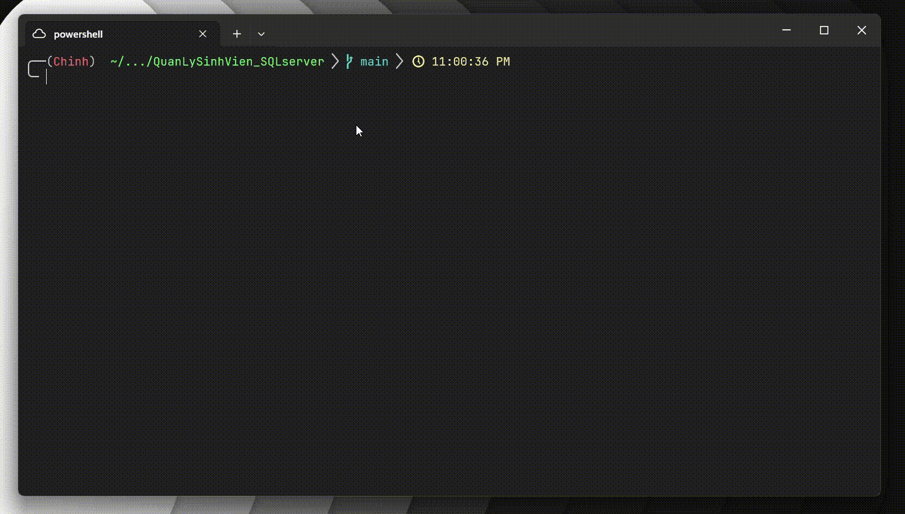
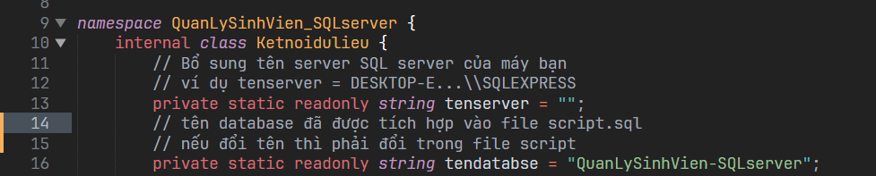
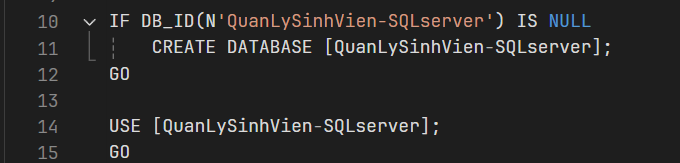

<p align="center">
  
</p>

<p align="center">
  <a href="https://github.com/trgchinhh/mophong-mahoabatdoixung">
    
  </a>
  <a href="LICENSE">
    
  </a>
  <a href="https://github.com/trgchinhh">
    
  </a>
</p>

## Quản lý sinh viên C#

Dự án này mô phỏng một hệ thống quản lý sinh viên dưới dạng ứng dụng console (CLI), được xây dựng bằng C#. Chương trình hướng đến việc mô phỏng quy trình quản lý trong môi trường thực tế, bao gồm đăng nhập và đăng xuất tài khoản giảng viên, quản lý lớp học, quản lý thông tin sinh viên và lưu trữ dữ liệu vào cơ sở dữ liệu thật.



## Dự án được xây dựng với mục tiêu

- Rèn luyện tư duy lập trình OOP thông qua một project nhỏ 
- Làm quen việc tổ chức mã nguồn, tách module hiệu quả 
- Mô phỏng hệ thống đăng nhập / đăng ký, tài khoản giảng viên 
- Lưu dữ liệu vào cơ sở dữ liệu thật (SQL server)

## Kiến trúc hệ thống vận hành 

```bash
┌───────────────────────────────────────┐
│           KẾT NỐI DATABASE            │
├───────────────────────────────────────┤
│ • Kết nối SQL Server                  │
│ • Kiểm tra kết nối thành công ?       │
└───────────────────┬───────────────────┘
                    │ (*) Thành công
                    │ (✗) Thất bại: báo lỗi và thoát
┌───────────────────┴───────────────────┐
│             MENU CHỌN MÀU             │
├───────────────────────────────────────┤
│ • [01] Màu đỏ                         │
│ • [02] Màu xanh lá                    │
│ • [03] Màu vàng                       │
│ • [04] Màu cam                        │
│ • [05] Màu xanh ngọc                  │
│ • [06] Màu xanh cyan                  │
│ • [07] Màu mặc định                   │
│ • [08] Thoát                          │
└───────────────────┬───────────────────┘
                    │
┌───────────────────┴───────────────────┐
│            MENU TÀI KHOẢN             │
├───────────────────────────────────────┤
│ • [01] Đăng nhập                      │
│ • [02] Đăng ký                        │
│ • [03] Xem tài khoản giảng viên mẫu   │
│ • [04] Thoát                          │
└───────────────────┬───────────────────┘
                    │ (*) Đăng nhập thành công
                    │ (✗) Sai 3 lần: thoát
┌───────────────────┴───────────────────┐
│          CHƯƠNG TRÌNH CHÍNH           │
├───────────────────────────────────────┤
│ • [00] Thay màu                       │
│ • [01] Xem danh sách                  │
│ • [02] Thêm sinh viên                 │
│ • [03] Sửa thông tin                  │
│ • [04] Lọc thông tin                  │
│ • [05] Sắp xếp thông tin              │
│ • [06] Xóa thông tin                  │
│ • [07] Thống kê                       │
│ • [08] Đăng xuất (về menu tài khoản)  │
└───────────────────────────────────────┘
```
> Lưu ý: Mỗi giảng viên khi tạo tài khoản phải tạo luôn lớp của mình, vì 1 tài khoản Gv chỉ chủ nhiệm 1 lớp 

## Cơ sở dữ liệu 

Dự án sử dụng SQL server để lưu trữ thông tin
Các bảng dữ liệu chính bao gồm: 
- Tài khoản giảng viên 
- Thông tin lớp 
- Thông tin sinh viên
- Kèm quan hệ giữa các bảng 

## Yêu cầu hệ thống 

- Nếu dùng text editor như Vscode, Sublime text, Vim, ...
  + Cài đặt .NET SDK (trình biên dịch C#)
- Nếu dùng Visual Studio thì cài .NET sẵn trong app
- Cài đặt SQL Server
- Cài đặt SQL Server Management Studio (SSMS)

## Clone dự án về máy 
```bash
git clone https://github.com/Interstella-OS/Blockchain-Miner.git
cd Blockchain-Miner
```

## Cấu hình SQL server

Trước khi chạy chương trình, đảm bảo SQL server đã được tạo databse 

Nếu muốn lưu trữ ở đường dẫn mình tự chọn
- Vào SSMS tạo database mới đặt tên là 'QuanLySinhVien-SQLserver'
- Set đường dẫn chứa database ở nơi muốn lưu  
- Mở file `sql/script.sql` và chạy trong SSMS
- Script chạy không báo lỗi là thành công 

Nếu muốn lưu ở đường dẫn mặc định của SSMS
- Mở folder SQL/script.sql và chạy trong SSMS
- Script chạy không báo lỗi là thành công 

Chỉnh lại tên server trong file `src/data/Ketnoidulieu.cs` đang để trống
- Vào SSMS copy tên server có dạng `DESKTOP-E.....\SQLEXPRESS`
- Vào file paste vào tenserver đang để trống  



Nếu muốn đổi tên database thành tên khác
- Đổi trong file `src/data/Ketnoidulieu.cs`
- Đổi trong file `sql/script.cs`
- Chổ nào có tên cũ thay thành tên muốn đổi 



Đảm bảo service `SQL Server (SQLEXPRESS)` được chạy 
- Nhấn Win + R nhập services.msc
- Tìm `SQL Server (SQLEXPRESS)` và ấn start, apply 

## Biên dịch và khởi chạy 
```bash
dotnet run 
```

## Một số giới hạn 

Đây là dự án phục vụ mục đích học tập và mô phỏng hệ thống quản lý nên sẽ có những lỗi không mong muốn phát sinh trong quá trình thử nghiệm 

Môt số thành phần sẽ được tiếp tục cải thiện 

- [x] Cơ chế xác thực đăng nhập / đăng ký 
- [x] Kiểm tra và chuẩn hóa nội dung đầu vào
- [x] Thiết kế cơ sở dữ liệu 
- [x] Phát triển tính năng thống kê
- [ ] Cải thiện bảo mật tài khoản
- [ ] Bổ sung Logging

## Tác giả
**Nguyễn Trường Chinh (NTC++)**<br>
**Github:** [https://github.com/trgchinhh](https://github.com/trgchinhh)

---

> 📌 Dự án nhỏ được phát triển với mục đích học tập và nghiên cứu. Mọi góp ý và đóng góp đều được hoan nghênh. Nếu thấy hữu ích thì cho mình xin 1 sao cho repo này !!!